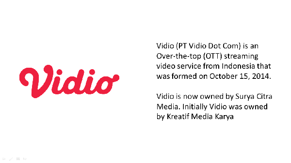

# Data Driven Decisions On Video Streaming Platform

## WHAT IS OTT?
An over-the-top (OTT) media service is a media service offered directly to viewers via the Internet. - Wikipedia

> ## **_Disclaimer: The [dataset](/src/.) used is not a real data_**
> ## **Graph display using Tableau**

# Problem Statement 1
The C-level asked the content team to provide a budget allocation report for each content that Vidio has invested in over the past 5 years. The report will help C-level's decision making in determining the amount of Vidio's content budget allocation in 2023.

## Action Genre in All Over Quadrant

The total content that Vidio has invested in from 2018 - 2022 is 1,090 content with a distribution of 
Action = 277
Anime, Cartoon, Family & Anime = 175
Crime, Horror & Thriller = 42
Documentary & Historical = 6
Drama & Romance = 443
Other = 147

## Serigala Terakhir Series in Must Have Category

Serigala Terakhir is the best series in terms of Audience Size value of 35.72% and Share of Attribution of 38.10%.
The worst content in terms of both Audience Size and Share of Attribution is the movie The Call Up.
With an Audience Size of 0.03% and a Share of Attribution of 10%.

## Serigala Terakhir Series Size

Audience Size Total Viewers = 5,970,274 million
Total Video Users = 16,715,372 million, Audience Share = 35.72%

Share of Attribution
Number of viewers who subscribed because of Serigala Terakhir = 2,274,674, Attribution Share = 38.10%

## Vidio Original in Action Genre 

In the Vidio Original action genre, there is no content that falls into the Neglectable category. 
The Jawara Series has the smallest Audience Share of 3.38% and the Share of Attribution is 39.4%.
Meanwhile, Pertaruhan The Series has an Audience Share of 30.12% and a Share of Attribution of 33.9%.

## Action Genre from Vidio Premiere Mostly in Nice to Have Category

There are not many contents with the Vidio Premiere action genre that fall into the Must Have category. 
Most of Vidio Premiere's action genre content falls into the Nice to Have and Neglectable categories. This is because there is a possibility that Vidio users do not know what action movies are on Vidio.

## Not Many Drama & Romance Content in Must Have Category

There is a lot of content with drama and romance genres on Vidio. But a lot of content falls into the Essential and Nice to Have categories. 
My Nerd Girl series content is the best content from the Audience Share value of 26.15% and Attribution Share of 39.42%.

## Stand by Me Doraemon is the most favorite content from anime, cartoon, family and kids genre

Stand by Me Doraemon is content that falls into the Must Have Category. With an Audience Share of 13.79% and an Attribution Share of 45.79%. It can be seen that many fans of the movie have subscribed to Vidio to watch the movie Stand by Me Doraemon. 
This is because not only children but many adults like the movie Doraemon. 

## Football Match is Must Have Contents

Other genres consist of several types of content, namely awards shows, comedy, fashion, fiction, football, music, pop, and variety shows. 
The Serie A Italian League is a Must Have content. Because Indonesians like to watch soccer matches. Audience Share is 28.05% and Attribution Share is 24.23%.

## Summary of Content Quadrant
- The action genre is the most dominant genre and falls into all categories, Must Have, Nice to Have, Essential and Neglectable.
- Series that have similar genres, storylines and characters to the Serigala Terakhir Series will have good ratings.
- It should be improved what action movie campaigns are on Vidio.
- Content that is worth investing in is content such as the Serigala Terakhir series, My Nerd Girl, Football Match, anime like Doraemon.

# Problem Statement 2
The C-level wants to know how much growth Vidio will have in 2018-2021 and the device most used by users to watch content on Vidio. So, the Business Intelligence team was asked to create the report/dashboard using Business Metrics data.

## Vidio Continues to Grow Despite in the Pandemic

##### **_(The line chart was chosen because it allows us to see the change in value over time)_**

Chart Analysis 
1. August 2018 had the highest viewership and viewership never reached that point in 2019.
2. From January to April 2020, there was an increase but it decreased again due to the pandemic.
3. From June 2020 to December 2021, there was a constant increase in viewership. 

## April 2020 is the highest growth in 2018-2021

Unlike the viewership line chart, December 2021 is not the month that has the highest growth rate, but April 2020. April 2020 had higher growth than March 2020 and was the highest month from 2018-2021.

## User’s Vidio Mostly Use Smartphone to Watch Contents

Vidio users watch Vidio content using smartphones by 49.43%, Smart TVs by 33.89% and PCs by 16.69%. This can happen because of the following possibilities : 
1. The content on Vidio is more convenient to view using a smartphone.
2. Many Vidio users do not have Smart TV and PC.

# Summary Business Metrics
- Viewership on Vidio has been rising steadily even during the pandemic. 
- Vidio's growth was highest at the beginning of the pandemic. 
- Vidio users mostly watch content using smartphones. Thus, Vidio must provide content that is not too long in duration so that smartphone users can watch comfortably.
- Users who use PCs are the smallest, this is because there are many users who do not have PCs and/or ignorance of Vidio users that Vidio can be accessed using a PC. 

